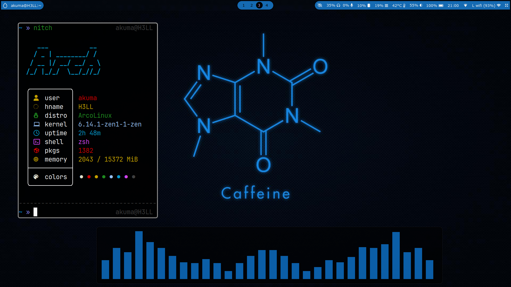
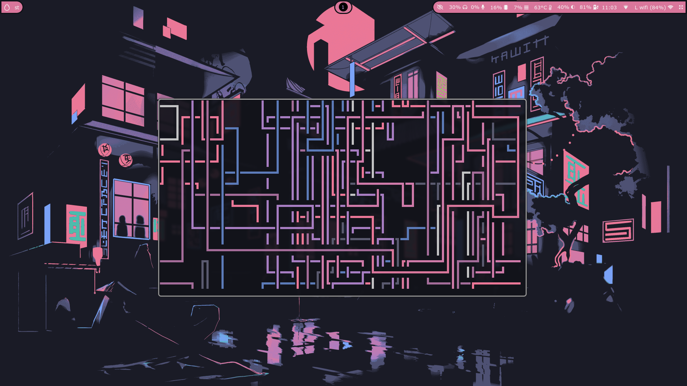

- Install
```bash
bash <(curl -s https://raw.githubusercontent.com/TH-O-R/hypr-dots/refs/heads/master/install.sh)
```

<h1 align="center">🔥System Overview🔥</h1>



## More Screenhots can be accessed <a href="https://github.com/TH-O-R/hypr-dots/tree/master/SS">here</a>
